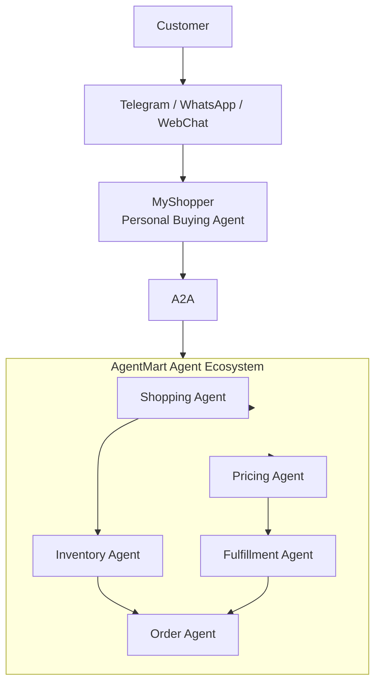

# Building Autonomous AI Agents

Workshop material for building autonomous AI agents from a single assistant into a coordinated agent ecosystem.

## Day 3: OpenClaw/NanoClaw Personal Buying Agent

Day 3 focuses on building **MyShopper**, a personal buying agent owned by the customer. Unlike the AgentMart agents built earlier, MyShopper represents the customer and communicates with AgentMart through **A2A**.

The customer interacts with MyShopper through Telegram, WhatsApp, or WebChat. MyShopper then coordinates with the AgentMart ecosystem to search, price, reserve, fulfill, and place an order.

## Architecture



## System Flow

```text
Customer
   |
Telegram / WhatsApp / WebChat
   |
   v
MyShopper (Personal Buying Agent)
   |
   | A2A
   v
AgentMart
   |
   +-- Shopping Agent
   |      |
   |      v
   |   Inventory Agent
   |      |
   |      v
   +-- Order Agent
   ^
   |
Pricing Agent
   |
   v
Fulfillment Agent
```

## Agent Responsibilities

| Agent | Represents | Main responsibility |
| --- | --- | --- |
| Customer | User | Requests products or buying help through chat. |
| MyShopper | Customer | Understands customer intent and negotiates with AgentMart through A2A. |
| Shopping Agent | AgentMart | Searches for suitable products and options. |
| Pricing Agent | AgentMart | Checks pricing, discounts, and affordability. |
| Inventory Agent | AgentMart | Confirms stock and availability. |
| Fulfillment Agent | AgentMart | Handles delivery or pickup constraints. |
| Order Agent | AgentMart | Finalizes the purchase workflow. |

## Workshop Progression

```text
Day 1: Build an Agent
   |
   v
Day 2: Build an Agent Team
   |
   v
Day 3: Build an Agent Ecosystem
```

## Reference Images

The README diagram is based on the provided requirement screenshots:

- `docs/1000099929.png`
- `docs/1000099932.png`
