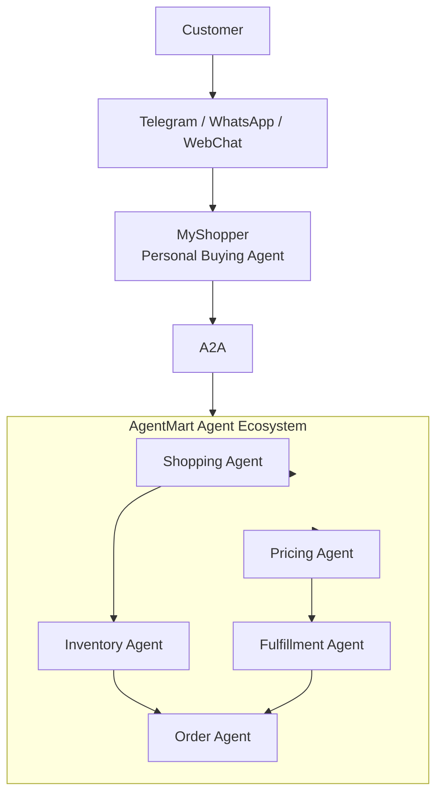
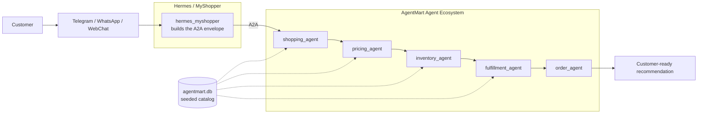

# Building Autonomous AI Agents

Workshop material for building autonomous AI agents from a single assistant into a coordinated agent ecosystem.

## Day 3: OpenClaw/Hermes/NanoClaw Personal Buying Agent

Day 3 focuses on building **Hermes/MyShopper**, a personal buying agent owned by the customer. Unlike the AgentMart agents built earlier, MyShopper represents the customer and communicates with AgentMart through **A2A**.

The customer interacts with MyShopper through Telegram, WhatsApp, or WebChat. MyShopper then coordinates with the AgentMart ecosystem to search, price, reserve, fulfill, and place an order.

## Prerequisites

- Python 3.10 or newer
- An OpenRouter account and API key (<https://openrouter.ai/keys>)
- On Ubuntu/Debian: `sudo apt install python3 python3-venv python3-pip`

## Getting Started

The hands-on lab lives in `workshop/agentmart_agent_ecosystem`. It implements the
architecture below with LangGraph, an A2A envelope, and a seeded product catalog.

### macOS / Ubuntu

```bash
cd workshop
./setup.sh
cd agentmart_agent_ecosystem
source .venv/bin/activate
```

`setup.sh` finds a Python 3.10+ interpreter, creates the virtual environment,
installs dependencies, seeds the product listing into SQLite, and copies
`.env.example` to `.env`.

### Windows (PowerShell)

```powershell
cd workshop\agentmart_agent_ecosystem
python -m venv .venv
.\.venv\Scripts\Activate.ps1
pip install -r requirements.txt
Copy-Item .env.example .env
python seed_data.py
```

### Install Hermes

Hermes/MyShopper is not a separate package — it is the personal buying agent
built into the lab (`hermes_myshopper` node plus `hermes_a2a_config.json`).
Running `setup.sh` above installs it. Verify it can reach the model with:

```bash
python agentmart_ecosystem.py --check-model
```

### Configure the model (OpenRouter + Kimi K3)

The lab talks to **Kimi K3** (`moonshotai/kimi-k3`) through OpenRouter's
OpenAI-compatible API. Create a key at <https://openrouter.ai/keys> and set it
in `.env`:

```text
OPENROUTER_API_KEY=sk-or-v1-...
OPENROUTER_BASE_URL=https://openrouter.ai/api/v1
OPENROUTER_MODEL=moonshotai/kimi-k3
OPENROUTER_TEMPERATURE=0.2
OPENROUTER_MAX_TOKENS=6000
OPENROUTER_REASONING_EFFORT=low
```

Settings resolve environment first, then the `hermes_agent.model` block in
`hermes_a2a_config.json`, then built-in defaults — so `.env` overrides the
config without editing it. The config also declares `fallback_models`
(`moonshotai/kimi-k2.6`, `moonshotai/kimi-k2-0905`), which OpenRouter retries
if Kimi K3 is unavailable.

### Run the ecosystem

Set `OPENROUTER_API_KEY` in `.env`, then:

```bash
# Walk the LangGraph/A2A flow without calling a model
python agentmart_ecosystem.py --dry-run "Find me wireless earbuds under $120 with good battery life."

# Live run through OpenRouter
python agentmart_ecosystem.py "Find me wireless earbuds under $120 with good battery life."
```

See `workshop/README.md` for lab details and `workshop/agentmart_agent_ecosystem/README.md`
for the full walkthrough, including how to edit and re-seed the product catalog.

## Repository Layout

| Path | Contents |
| --- | --- |
| `workshop/` | Hands-on labs and the `setup.sh` environment script. |
| `workshop/agentmart_agent_ecosystem/` | Day 3 lab: LangGraph agents, A2A config, seeded catalog. |
| `slides/` | Lecture deck and the branded slide build script. |
| `teleprompter_slides/` | Rendered slide images used by `teleprompter.html`. |
| `teleprompter.html` | Presenter view for delivering the workshop. |
| `docs/` | Lesson PDFs, notes, and requirement screenshots. |

## Architecture (Conceptual)

The target design from the requirement screenshots:



## Implemented Flow (Lab)

`workshop/agentmart_agent_ecosystem/agentmart_ecosystem.py` builds this as a
**linear LangGraph pipeline**, so each agent can read every upstream result:



| Step | Node | Produces |
| --- | --- | --- |
| 1 | `hermes_myshopper` | A2A envelope addressed to AgentMart |
| 2 | `shopping_agent` | 3 candidate SKUs from the seeded catalog |
| 3 | `pricing_agent` | Value ranking and price risks |
| 4 | `inventory_agent` | Stock status and restock dependencies |
| 5 | `fulfillment_agent` | Delivery path, ETA, and cost |
| 6 | `order_agent` | Final recommendation for the customer |

The run returns the full graph state as JSON, including a `transcript` array with
each agent's output and the A2A envelope Hermes sent.

## Agent Responsibilities

| Agent | Represents | Main responsibility |
| --- | --- | --- |
| Customer | User | Requests products or buying help through chat. |
| MyShopper | Customer | Understands customer intent and negotiates with AgentMart through A2A. |
| Shopping Agent | AgentMart | Searches for suitable products and options. |
| Pricing Agent | AgentMart | Checks pricing, discounts, and affordability. |
| Inventory Agent | AgentMart | Confirms stock and availability. |
| Fulfillment Agent | AgentMart | Handles delivery or pickup constraints. |
| Order Agent | AgentMart | Finalizes the purchase workflow. |

In the lab, the Shopping, Pricing, Inventory, and Fulfillment agents read a seeded
catalog (`workshop/agentmart_agent_ecosystem/data/products.json`) so they reason over
real SKUs, prices, stock levels, and delivery options rather than invented ones.

## Workshop Progression

```text
Day 1: Build an Agent
   |
   v
Day 2: Build an Agent Team
   |
   v
Day 3: Build an Agent Ecosystem
```

## Troubleshooting

| Symptom | Fix |
| --- | --- |
| `The venv module is missing` | `sudo apt install python3.X-venv` (the script names your version) |
| `api_key : MISSING` from `--check-model` | Set `OPENROUTER_API_KEY` in `workshop/agentmart_agent_ecosystem/.env` |
| `catalog unavailable` in agent output | Run `python seed_data.py` in the lab folder |
| `401` / `No auth credentials` from OpenRouter | The key is wrong or revoked; create a new one at <https://openrouter.ai/keys> |
| Model slug not found | Check the slug against <https://openrouter.ai/models>; try a fallback such as `moonshotai/kimi-k2.6` |

Re-run setup from scratch at any time:

```bash
cd workshop
./setup.sh --force --reset-db
```

## Reference Images

The conceptual architecture diagram is based on the provided requirement screenshots:

- `docs/1000099929.png`
- `docs/1000099932.png`
