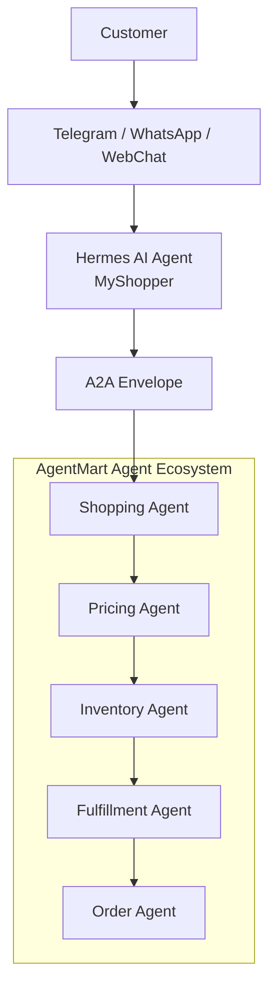

# AgentMart Agent Ecosystem

This workshop lab implements the Day 3 architecture from the root `README.md`:

```text
Customer -> Chat -> Hermes / MyShopper -> A2A -> AgentMart agent group
```

The sample uses LangGraph to model the agent workflow and the OpenAI Python SDK pointed at OpenRouter for model calls.

## Architecture



## Files

| File | Purpose |
| --- | --- |
| `agentmart_ecosystem.py` | LangGraph implementation of Hermes/MyShopper plus AgentMart agents. |
| `hermes_a2a_config.json` | Hermes agent configuration for the A2A connection into AgentMart. |
| `requirements.txt` | Python dependencies for the lab. |
| `.env.example` | Environment variable template for OpenRouter. |

## Setup

```powershell
cd D:\Projects\Building-Autonomous-AI-Agent\workshop\agentmart_agent_ecosystem
python -m venv .venv
.\.venv\Scripts\Activate.ps1
pip install -r requirements.txt
Copy-Item .env.example .env
```

Edit `.env` and set `OPENROUTER_API_KEY`.

OpenRouter uses an OpenAI-compatible API surface, so the code sets:

```text
OPENROUTER_BASE_URL=https://openrouter.ai/api/v1
OPENROUTER_MODEL=openai/gpt-5.2
```

You can change `OPENROUTER_MODEL` to any OpenAI model slug available in your OpenRouter account.

## Hermes A2A Configuration

`hermes_a2a_config.json` makes the A2A handoff explicit:

- Hermes agent identity: `hermes_myshopper`
- Hermes role: represents the customer
- Supported channels: Telegram, WhatsApp, WebChat
- OpenRouter model settings: read from the `.env` variables
- A2A task endpoint: `agentmart://a2a/tasks`
- Heartbeat stream: `agentmart.a2a.heartbeats`
- Capability registry: `agentmart.a2a.capabilities`
- Target AgentMart agents: Shopping, Pricing, Inventory, Fulfillment, and Order

The LangGraph demo loads this file and embeds the connection metadata into the A2A envelope that Hermes sends to AgentMart.

## Run

Dry-run mode does not call the model. It is useful for checking the LangGraph/A2A flow:

```powershell
python agentmart_ecosystem.py --dry-run "Find me wireless earbuds under $120 with good battery life."
```

Live mode calls OpenRouter:

```powershell
python agentmart_ecosystem.py "Find me wireless earbuds under $120 with good battery life."
```

## Flow

1. Hermes/MyShopper receives the customer request from a chat channel.
2. Hermes creates an A2A task envelope addressed to the AgentMart ecosystem.
3. The Shopping Agent finds candidate products.
4. The Pricing Agent evaluates price and value.
5. The Inventory Agent checks availability.
6. The Fulfillment Agent checks delivery constraints.
7. The Order Agent produces a final customer-ready recommendation.
