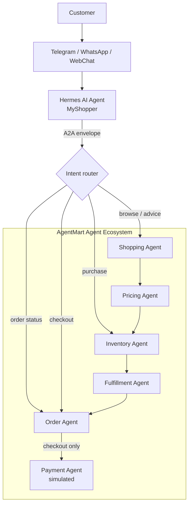

# AgentMart Agent Ecosystem

This workshop lab implements the Day 3 architecture from the root `README.md`:

```text
Customer -> Chat -> Hermes / MyShopper -> A2A -> AgentMart agent group
```

The sample uses LangGraph to model the agent workflow and the OpenAI Python SDK pointed at OpenRouter for model calls.

## Architecture



Hermes classifies the customer message, then only the agents that intent needs
are woken. A status question does not wake the whole ecosystem.

| Customer intent | Example message | Agents woken |
| --- | --- | --- |
| `order_status` | "What is my order status?" | Order |
| `browse_catalog` | "List me the available products." | Shopping, Pricing, Inventory, Order |
| `product_advice` | "Find me wireless earbuds under $120." | Shopping, Pricing, Inventory, Fulfillment, Order |
| `purchase_intent` | "I want to buy this AM-EAR-1002." | Inventory, Fulfillment, Order |
| `checkout_payment` | "Checkout and pay for my order." | Order, Payment |

Routing is rule-based rather than model-driven, so a scenario run is
reproducible and the assertions in `test_scenarios.py` mean something. The
routing table lives in `INTENT_PATHS` (`agentmart_ecosystem.py`) and is mirrored
in `hermes_a2a_config.json` under `intent_routing`.

## Files

| File | Purpose |
| --- | --- |
| `agentmart_ecosystem.py` | LangGraph implementation of Hermes/MyShopper plus AgentMart agents. |
| `hermes_a2a_config.json` | Hermes agent configuration for the A2A connection into AgentMart. |
| `seed_data.py` | Seeds the product listing from `data/products.json` into SQLite. |
| `catalog.py` | Query helpers the agents use to read the seeded listing. |
| `orders.py` | Read/write helpers over the order book: orders, payments, draft orders. |
| `test_scenarios.py` | End-to-end scenario suite for the Hermes + A2A flows. |
| `data/products.json` | Source product catalog: products, stock, warehouses, delivery options. |
| `data/orders.json` | Source order book: customers, orders, payment methods, payments. |
| `data/agentmart.db` | Generated SQLite database (git-ignored; created by `seed_data.py`). |
| `requirements.txt` | Python dependencies for the lab. |
| `.env.example` | Environment variable template for OpenRouter. |

## Setup

### macOS / Ubuntu

```bash
cd workshop
./setup.sh
cd agentmart_agent_ecosystem
source .venv/bin/activate
```

One script creates the virtual environment, installs dependencies, seeds the
product listing, and copies `.env.example` to `.env`. Useful flags:
`--force` (rebuild the venv), `--reset-db` (rebuild the seeded data),
`--no-seed` (skip seeding).

### Windows (PowerShell)

```powershell
cd D:\Projects\Building-Autonomous-AI-Agent\workshop\agentmart_agent_ecosystem
python -m venv .venv
.\.venv\Scripts\Activate.ps1
pip install -r requirements.txt
Copy-Item .env.example .env
python seed_data.py
```

Edit `.env` and set `OPENROUTER_API_KEY`.

## Installing Hermes

Hermes/MyShopper is **not a separate package** — there is nothing to `pip install`.
It is the personal buying agent built into this lab:

| Piece | Where it lives |
| --- | --- |
| Agent node | `hermes_myshopper_node()` in `agentmart_ecosystem.py` |
| Agent identity, channels, capabilities | `hermes_a2a_config.json` -> `hermes_agent` |
| A2A connection into AgentMart | `hermes_a2a_config.json` -> `a2a_connection` |
| Model client | `OpenRouterHermesClient` in `agentmart_ecosystem.py` |

So "installing Hermes" means installing the lab environment:

```bash
cd workshop
./setup.sh                  # venv + dependencies + seeded catalog + .env
cd agentmart_agent_ecosystem
source .venv/bin/activate
```

Confirm Hermes is wired up and can reach OpenRouter:

```bash
python agentmart_ecosystem.py --check-model
```

This prints the resolved model settings and makes one real call. Without a key it
reports `api_key : MISSING` and exits non-zero, so it is a safe first check.

## Configuring the Model (OpenRouter + Kimi K3)

The lab defaults to **Kimi K3** (`moonshotai/kimi-k3`, Moonshot AI) through
OpenRouter's OpenAI-compatible API.

### 1. Get an API key

Create one at <https://openrouter.ai/keys> and put it in `.env`:

```bash
OPENROUTER_API_KEY=sk-or-v1-...
```

### 2. Set the model

`.env` already ships with the Kimi K3 settings:

```text
OPENROUTER_BASE_URL=https://openrouter.ai/api/v1
OPENROUTER_MODEL=moonshotai/kimi-k3
OPENROUTER_TEMPERATURE=0.2
OPENROUTER_MAX_TOKENS=1200
```

### 3. How settings resolve

Three layers, first match wins:

| Priority | Source | Use it for |
| --- | --- | --- |
| 1 | Environment / `.env` | Your key and per-machine overrides |
| 2 | `hermes_a2a_config.json` -> `hermes_agent.model` | The agent's declared default |
| 3 | Built-in defaults in `agentmart_ecosystem.py` | Last resort |

The config block declares the model as part of the agent's identity:

```json
"model": {
  "provider": "openrouter",
  "default_model": "moonshotai/kimi-k3",
  "fallback_models": ["moonshotai/kimi-k2.6", "moonshotai/kimi-k2-0905"],
  "temperature": 0.2,
  "max_tokens": 1200
}
```

`fallback_models` is passed to OpenRouter as its `models` array, so a request is
automatically retried down the list if the primary model is unavailable.

### 4. Kimi models on OpenRouter

| Slug | Context | Notes |
| --- | --- | --- |
| `moonshotai/kimi-k3` | 1M | Lab default; strongest reasoning |
| `moonshotai/kimi-k2.6` | 262K | Cheaper fallback |
| `moonshotai/kimi-k2-0905` | 262K | Cheapest fallback |
| `moonshotai/kimi-k2-thinking` | 262K | Extended reasoning traces |

Switch model for a single run without editing any file:

```bash
OPENROUTER_MODEL=moonshotai/kimi-k2.6 python agentmart_ecosystem.py --check-model
```

Because the client is OpenAI-compatible, any other OpenRouter slug
(`openai/...`, `anthropic/...`) works the same way.

## Hermes A2A Configuration

`hermes_a2a_config.json` makes the A2A handoff explicit:

- Hermes agent identity: `hermes_myshopper`
- Hermes role: represents the customer
- Supported channels: Telegram, WhatsApp, WebChat
- OpenRouter model settings: read from the `.env` variables
- A2A task endpoint: `agentmart://a2a/tasks`
- Heartbeat stream: `agentmart.a2a.heartbeats`
- Capability registry: `agentmart.a2a.capabilities`
- Target AgentMart agents: Shopping, Pricing, Inventory, Fulfillment, and Order

The LangGraph demo loads this file and embeds the connection metadata into the A2A envelope that Hermes sends to AgentMart.

## Seeded Product Listing

`seed_data.py` loads `data/products.json` into `data/agentmart.db` (SQLite,
standard library only) across four tables: `products`, `inventory`,
`warehouses`, and `fulfillment_options`.

```bash
python seed_data.py                # create/refresh the database
python seed_data.py --reset        # drop and rebuild every table
python seed_data.py --list         # print the seeded listing
python seed_data.py --list --category audio/earbuds --max-price 120
```

Seeding is idempotent: re-running rewrites every row from the JSON source, so
editing `data/products.json` and re-running is the intended way to change the
catalog.

The Shopping, Pricing, Inventory, and Fulfillment agents receive this listing in
their prompts, so they cite real SKUs, prices, stock levels, and delivery ETAs.
Narrow what the agents see with `--category` and `--max-price`:

```bash
python agentmart_ecosystem.py --dry-run --category audio/earbuds --max-price 120 \
  "Find me wireless earbuds under $120 with good battery life."
```

If the database has not been seeded, the run still completes and the agents are
told the catalog is unavailable.

## Run

Dry-run mode does not call the model. It is useful for checking the LangGraph/A2A flow:

```bash
python agentmart_ecosystem.py --dry-run "Find me wireless earbuds under $120 with good battery life."
```

Live mode calls OpenRouter:

```bash
python agentmart_ecosystem.py "Find me wireless earbuds under $120 with good battery life."
```

## Flow

1. Hermes/MyShopper receives the customer request from a chat channel.
2. Hermes classifies the intent and creates an A2A task envelope addressed to the
   AgentMart ecosystem. Every later hop reuses that envelope's `correlation_id`.
3. The router wakes only the agents that intent needs (see the table above).
4. Each agent hop appends its own envelope to `a2a_log`, moving through the
   `proposed -> accepted -> in_progress -> completed` lifecycle from Part 7.
5. The Order Agent answers from the order book, or creates a draft order.
6. On a checkout intent the Payment Agent settles it — simulated (see below).

## Seeded Order Book

`data/orders.json` seeds three customers, five orders across every lifecycle
state, their payment methods, and their payment history. This is what makes
"what is my order status" and "checkout and pay" resolve against real rows.

```bash
python seed_data.py --list-orders    # print the seeded order book
```

| Customer | Channel | Orders |
| --- | --- | --- |
| `CUST-1001` Wei Ling Tan | Telegram | delivered, in_transit, **awaiting_payment** |
| `CUST-1002` Arun Prakash | WhatsApp | packed |
| `CUST-1003` Mei Chen | WebChat | cancelled (refunded) |

`CUST-1001` is the default customer, and its `awaiting_payment` order is what a
bare "checkout and pay" settles. Override with `--customer`.

### Payments are simulated

The Payment Agent writes `authorized` then `captured` rows into the local SQLite
database and generates a `sim_auth_...` reference. **No payment processor is ever
contacted, no card number is stored, and no money moves.** The agent is
instructed to say so in its reply.

## Scenario Suite

`test_scenarios.py` sends one customer message per scenario through the real
LangGraph workflow, then asserts on what actually happened: the intent chosen,
the agents woken, the A2A envelope chain, and the resulting rows in the order
book.

```bash
python test_scenarios.py                  # all scenarios, dry-run
python test_scenarios.py --list           # list scenario names
python test_scenarios.py -s buy-this      # run one
python test_scenarios.py --verbose        # show the A2A hops and agent replies
python test_scenarios.py --live           # call OpenRouter for real
```

| Scenario | Message | What it proves |
| --- | --- | --- |
| `order-status` | "What is my order status?" | Only the Order Agent wakes; the real order book is read |
| `order-status-specific` | "Where is my order AM-ORD-...?" | An order id scopes the lookup to that one order |
| `order-status-unknown` | "Where is my order AM-ORD-9999-9999?" | A missing order degrades gracefully, no crash |
| `list-products` | "List me the available products." | Browsing skips the Fulfillment Agent; real SKUs reach the prompts |
| `buy-this` | "I want to buy this AM-EAR-1002." | A real draft order is created and stops at `awaiting_payment` |
| `checkout-and-pay` | "Checkout and pay for my order." | The unpaid order is settled; a simulated receipt is written |
| `product-advice` | "Find me wireless earbuds under $120." | The original full five-agent pipeline still runs |
| `buy-then-checkout` | purchase, then settle that order | Two turns on one order id = two distinct A2A tasks |

Dry-run is the default, so the whole suite passes with **no OpenRouter key**:
everything asserted is the deterministic part of the system — routing, the A2A
envelope chain, and order/payment state. `--live` sends the same scenarios
through the model as well.

The suite re-seeds the order book before each scenario and again at the end, so
runs are isolated and the lab is left in its seeded state. Pass `--no-reseed` to
inspect what a run left behind.
