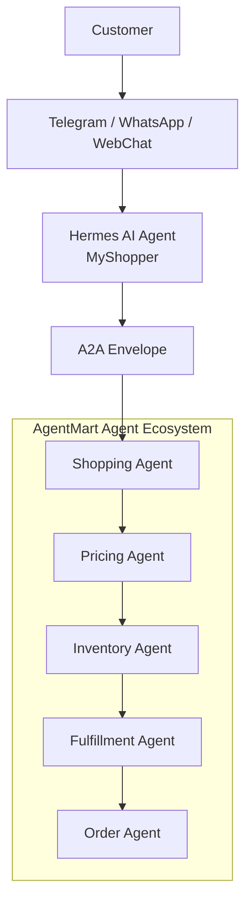

# AgentMart Agent Ecosystem

This workshop lab implements the Day 3 architecture from the root `README.md`:

```text
Customer -> Chat -> Hermes / MyShopper -> A2A -> AgentMart agent group
```

The sample uses LangGraph to model the agent workflow and the OpenAI Python SDK pointed at OpenRouter for model calls.

## Architecture



## Files

| File | Purpose |
| --- | --- |
| `agentmart_ecosystem.py` | LangGraph implementation of Hermes/MyShopper plus AgentMart agents. |
| `hermes_a2a_config.json` | Hermes agent configuration for the A2A connection into AgentMart. |
| `seed_data.py` | Seeds the product listing from `data/products.json` into SQLite. |
| `catalog.py` | Query helpers the agents use to read the seeded listing. |
| `data/products.json` | Source product catalog: products, stock, warehouses, delivery options. |
| `data/agentmart.db` | Generated SQLite database (git-ignored; created by `seed_data.py`). |
| `requirements.txt` | Python dependencies for the lab. |
| `.env.example` | Environment variable template for OpenRouter. |

## Setup

### macOS / Ubuntu

```bash
cd workshop
./setup.sh
cd agentmart_agent_ecosystem
source .venv/bin/activate
```

One script creates the virtual environment, installs dependencies, seeds the
product listing, and copies `.env.example` to `.env`. Useful flags:
`--force` (rebuild the venv), `--reset-db` (rebuild the seeded data),
`--no-seed` (skip seeding).

### Windows (PowerShell)

```powershell
cd D:\Projects\Building-Autonomous-AI-Agent\workshop\agentmart_agent_ecosystem
python -m venv .venv
.\.venv\Scripts\Activate.ps1
pip install -r requirements.txt
Copy-Item .env.example .env
python seed_data.py
```

Edit `.env` and set `OPENROUTER_API_KEY`.

## Installing Hermes

Hermes/MyShopper is **not a separate package** — there is nothing to `pip install`.
It is the personal buying agent built into this lab:

| Piece | Where it lives |
| --- | --- |
| Agent node | `hermes_myshopper_node()` in `agentmart_ecosystem.py` |
| Agent identity, channels, capabilities | `hermes_a2a_config.json` -> `hermes_agent` |
| A2A connection into AgentMart | `hermes_a2a_config.json` -> `a2a_connection` |
| Model client | `OpenRouterHermesClient` in `agentmart_ecosystem.py` |

So "installing Hermes" means installing the lab environment:

```bash
cd workshop
./setup.sh                  # venv + dependencies + seeded catalog + .env
cd agentmart_agent_ecosystem
source .venv/bin/activate
```

Confirm Hermes is wired up and can reach OpenRouter:

```bash
python agentmart_ecosystem.py --check-model
```

This prints the resolved model settings and makes one real call. Without a key it
reports `api_key : MISSING` and exits non-zero, so it is a safe first check.

## Configuring the Model (OpenRouter + Kimi K3)

The lab defaults to **Kimi K3** (`moonshotai/kimi-k3`, Moonshot AI) through
OpenRouter's OpenAI-compatible API.

### 1. Get an API key

Create one at <https://openrouter.ai/keys> and put it in `.env`:

```bash
OPENROUTER_API_KEY=sk-or-v1-...
```

### 2. Set the model

`.env` already ships with the Kimi K3 settings:

```text
OPENROUTER_BASE_URL=https://openrouter.ai/api/v1
OPENROUTER_MODEL=moonshotai/kimi-k3
OPENROUTER_TEMPERATURE=0.2
OPENROUTER_MAX_TOKENS=1200
```

### 3. How settings resolve

Three layers, first match wins:

| Priority | Source | Use it for |
| --- | --- | --- |
| 1 | Environment / `.env` | Your key and per-machine overrides |
| 2 | `hermes_a2a_config.json` -> `hermes_agent.model` | The agent's declared default |
| 3 | Built-in defaults in `agentmart_ecosystem.py` | Last resort |

The config block declares the model as part of the agent's identity:

```json
"model": {
  "provider": "openrouter",
  "default_model": "moonshotai/kimi-k3",
  "fallback_models": ["moonshotai/kimi-k2.6", "moonshotai/kimi-k2-0905"],
  "temperature": 0.2,
  "max_tokens": 1200
}
```

`fallback_models` is passed to OpenRouter as its `models` array, so a request is
automatically retried down the list if the primary model is unavailable.

### 4. Kimi models on OpenRouter

| Slug | Context | Notes |
| --- | --- | --- |
| `moonshotai/kimi-k3` | 1M | Lab default; strongest reasoning |
| `moonshotai/kimi-k2.6` | 262K | Cheaper fallback |
| `moonshotai/kimi-k2-0905` | 262K | Cheapest fallback |
| `moonshotai/kimi-k2-thinking` | 262K | Extended reasoning traces |

Switch model for a single run without editing any file:

```bash
OPENROUTER_MODEL=moonshotai/kimi-k2.6 python agentmart_ecosystem.py --check-model
```

Because the client is OpenAI-compatible, any other OpenRouter slug
(`openai/...`, `anthropic/...`) works the same way.

## Hermes A2A Configuration

`hermes_a2a_config.json` makes the A2A handoff explicit:

- Hermes agent identity: `hermes_myshopper`
- Hermes role: represents the customer
- Supported channels: Telegram, WhatsApp, WebChat
- OpenRouter model settings: read from the `.env` variables
- A2A task endpoint: `agentmart://a2a/tasks`
- Heartbeat stream: `agentmart.a2a.heartbeats`
- Capability registry: `agentmart.a2a.capabilities`
- Target AgentMart agents: Shopping, Pricing, Inventory, Fulfillment, and Order

The LangGraph demo loads this file and embeds the connection metadata into the A2A envelope that Hermes sends to AgentMart.

## Seeded Product Listing

`seed_data.py` loads `data/products.json` into `data/agentmart.db` (SQLite,
standard library only) across four tables: `products`, `inventory`,
`warehouses`, and `fulfillment_options`.

```bash
python seed_data.py                # create/refresh the database
python seed_data.py --reset        # drop and rebuild every table
python seed_data.py --list         # print the seeded listing
python seed_data.py --list --category audio/earbuds --max-price 120
```

Seeding is idempotent: re-running rewrites every row from the JSON source, so
editing `data/products.json` and re-running is the intended way to change the
catalog.

The Shopping, Pricing, Inventory, and Fulfillment agents receive this listing in
their prompts, so they cite real SKUs, prices, stock levels, and delivery ETAs.
Narrow what the agents see with `--category` and `--max-price`:

```bash
python agentmart_ecosystem.py --dry-run --category audio/earbuds --max-price 120 \
  "Find me wireless earbuds under $120 with good battery life."
```

If the database has not been seeded, the run still completes and the agents are
told the catalog is unavailable.

## Run

Dry-run mode does not call the model. It is useful for checking the LangGraph/A2A flow:

```bash
python agentmart_ecosystem.py --dry-run "Find me wireless earbuds under $120 with good battery life."
```

Live mode calls OpenRouter:

```bash
python agentmart_ecosystem.py "Find me wireless earbuds under $120 with good battery life."
```

## Flow

1. Hermes/MyShopper receives the customer request from a chat channel.
2. Hermes creates an A2A task envelope addressed to the AgentMart ecosystem.
3. The Shopping Agent picks candidate SKUs from the seeded product listing.
4. The Pricing Agent evaluates price and value against the listed prices.
5. The Inventory Agent checks availability from the seeded stock levels.
6. The Fulfillment Agent picks a delivery path from the seeded options.
7. The Order Agent produces a final customer-ready recommendation.
